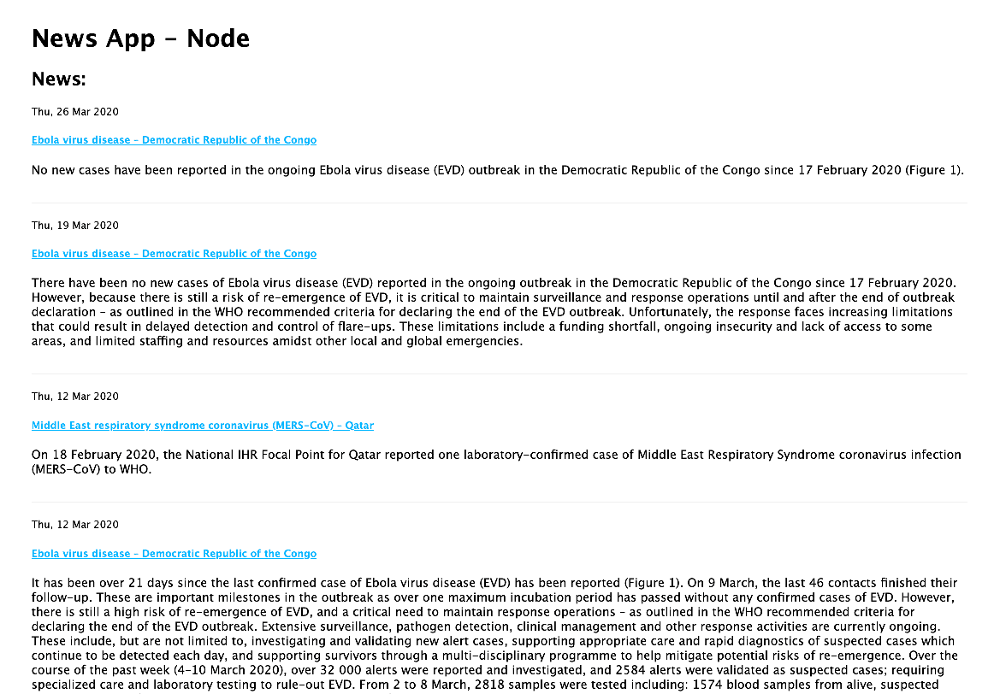

# Node News App




## Requirements

1. Docker: https://www.docker.com/
1. Docker Compose: https://docs.docker.com/compose/
1. NodeJS: https://nodejs.org/en/
1. Yarn: https://yarnpkg.com/

## Development

1. Copy default settings

```
cp .env.sample .env
```

2. Run docker containers

```
docker-compose up -d
```

3. Install dependencies

```
yarn
```

4. Run Application

```
yarn dev
```

5. Run the app

```
http://localhost:3000
````

### Graphql

See graphql interface by going to http://localhost:3000/graphql

#### Query

```
query getNews {
  news {
    id
    title
    link
    snippet
    date
  }
}
```